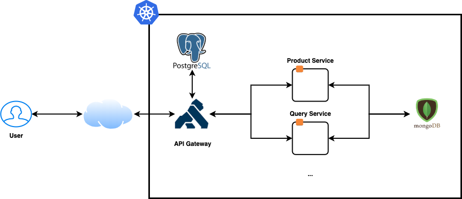
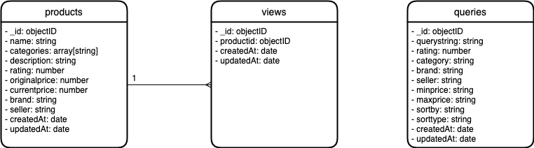
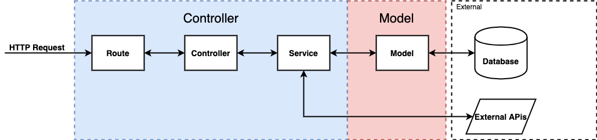
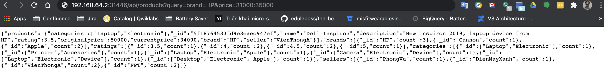
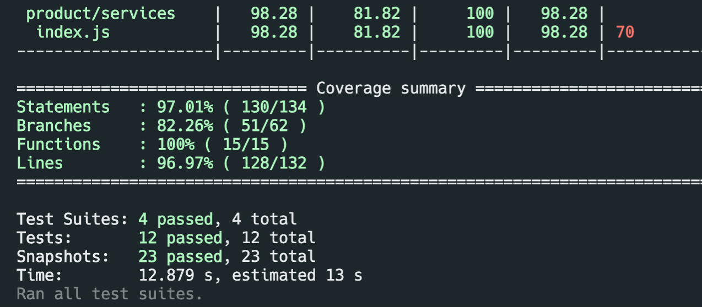

# iCommerce Project
# Designs
## Technologies
- Infrastructure  
  - **Kubernetes**: Project is designed to run on Kubernetes cluster. It's tested compatible with **Minikube** and **Docker For Desktop**  
  - **Docker**: All the services is configured to be built as docker images to be easier to deploy.  
- Database  
  - **MongoDB**: Database for services, main database info:  
    - Database Name: `icommerce`  
    - Database Port: `27017`  
    - Database Username: `icommerce`  
    - Database Password: `password`  
  - Postgres: Database for Kong API gateway  
- Routing  
  - **Kong API Gateway**: API Gateway for the microservice systems, can support main feature: `authentication`, `rate limit`, `routing`, `logging`.... Currently, I only use `routing` feature. Kong Gateway exposes 2 main services:  
    - `kong-admin`: rest service for configure service and routing  
    - `kong-proxy`: proxy for incoming requests  
- Implementation  
  - **Bash script**: Mainly use for set up environments.  
  - **Nodejs**: All services are written in `Javascript` on `Nodejs` framework. Since the architect is microservices, we can choose other platforms/languages to implement other services  
  - **Koa**: web framework for Nodejs  
  - **Mongoose**: object modelling for MongoDB  
- CI/CD  
  - **Skaffold**: Handle building, pushing and deploying into Kubernetes cluster  
- Testing  
  - **Jest**
  - **Supertest**
  - **Mockingoose**
  - **Sinon**
  - **sinon-mongoose**
## Architecture design  
  
- **Multitier architecture**: I choose 3-tier architecture for the system. Separate the system into 3 different component:  
  - Client: Web browser  
  - Application server: services  
  - Database  
- **Microservice**: I choose microservice architecture for the application server. This approach is a lot better than monolithic architecture.  
  - Better scaling
  - Decoupling services
  - Flexibility
  - ... 
- **API-Gateway pattern**: I choose API gateway pattern help controlling `authentication`, `rate limit`, `analytics`, `logging`....  
## Database design  
  
I choose **NoSQL** database MongoDB for faster implementation and easy to append later. The database is designed very simple. At that moment, there're 2 collections (table in relational databases) are:  
- **products**: store all products and products' information.  
- **queries**: store all searchs' information when user search, filter, sort the products.  
### Full text search  
There are a feature to search products, I think it should be better if we have **Full text search** feature in **products** table. Because of that, I enable text index for all string in that table. Product's **Search API** will support **Full Text Search**
```js
// kubernetes-manifests/mongodb.yaml
targetDb.products.createIndex( {"$**": "text"} );
```
## Service Implementation


The architecture of the Service still follow **MVC architecture**. The only change here is I removed the **View** component because the service don't have View.  

- **Controller**: Control all app logics/behavior. This component is separated into 3 sub component:  
  - **Route**: Control routing between incoming request url to appropriate handler.
  - **Controller**: Control handler logic and workflow
  - **Service**: Handle calculation, query data as well as interact with other external APIs.
- **Model**: Model the database, map between database's record into application's objects. Abstract database method for app to use.
## APIs  
| API | Method | Description |
|---|---|---|
| `api/products` | `GET` | Get list products and count of products's properties. **Note**: The counted value is based on result after `full text search`, other filters will not affect. This is match with ecommerce pages. |
| `api/products` | `POST` | Create new products |
| `api/products/find/:id` | `GET` | Get product by id |
| `api/queries` | `GET` | Get list queries |
| `api/queries` | `POST` | Create new queries record |
| `api/queries/find/:id` | `GET` | Get query by id |

### GET `api/products` URL Parameters
| Params | Type | Value |
|---|---|---|
| query | String | string to search, full text search |
| brand | String | brand to filter, find match |
| category | String | category to filter, find match |
| rating | Number | rating to filter, find gte |
| seller | String | seller to filter, find match |
| price | String | price to filter, format ```js ${min}:${max} ``` |
| sort | String | order the result, format ```js ${field}:${order} ```, order in [`min`, `max`] |
### GET `api/queries` URL Parameters
| Params | Type | Value |
|---|---|---|
| query | String | query string to search, full text search |
| category | String | category to filter, find match |
| brand | String | brand to filter, find match |
| rating | Number | rating to filter, find match |
| seller | String | seller to filter, find match |
| minprice | Number | min price to filter, find match |
| maxprice | Number | max price to filter, find match |
| sortby | String | order type to filter, find match |
| sorttype | String | order type to filter, find match |

**NOTE** URL parameters is case sensitive, please use the correct form in order to get the correct result

### Product query example   


# Build and Deploy  
## Set up environment   
### Prerequisites  
- **kubectl**: This tool is used to interact with the kubernetes cluster. Follow this [link](https://kubernetes.io/docs/tasks/tools/install-kubectl/) to install kubectl on your local machine.  
- **Local Kubernetes Cluster**:  
  - **Minikube**: Follow this [link](https://kubernetes.io/docs/tasks/tools/install-minikube/) to install. After install, start minikube by running:  
  ```sh
    minikube start
  ```
  - **Docker For Desktop**: Download installation file [here](https://www.docker.com/products/docker-desktop). After install, enable kubernetes local cluster.  
- **Skaffold**: Follow this [instruction](https://skaffold.dev/docs/install/)  
- **Docker**: Help building the services' docker images on machine.  
## Build  
- First, verify cluster is started and `kubectl` can communicate with `Kubernetes master`  
```sh
  kubectl cluster-info
```
- Now build the services  
  - **Build with skaffold (Tested)**  
  ```sh
    skaffold build
  ```
  - **Build without skaffold (Tested)**  
  ```sh
    # If you use Minikube, uncomment the following command:
    # eval $(minikube docker-env)
    # Run the following command for each service inside services folder
    docker build -t icommerce/${service}-service services/${service}
  ```
## Deploy  
- First deploy resources on cluster  
  - **Deploy with skaffold (Tested)**  
  ```sh
    skaffold run
  ```
  - **Deploy without skaffold (Tested)**  
  ```sh
    kubectl apply -f kubernetes-manifests/
  ```
- Setup the Kong API's routes information  
  - **For minikube (Tested)**  
  ```sh
    ./setup/kong-routing-setup.sh
  ```
  - **For other clusters (Untested)**: change the `hostname` to accessible url of Kong's admin api.  
## Verify  
- **For minikube (Tested)**: run the following command to open browser  
  ```sh
    minikube service kong-proxy -n kong
  ```
- **For other clusters (Untested)**: enter the accessible url of Kong's proxy api in your browser to test.  

## Unittest
- Go to `services/${service_name}` and run the following command:
```sh
npm test
```

The test's result will looks like


# Future upgrade  
- **Service mesh** is used to improve service's internal calls, currently this is done via Kong-Proxy
- Update **database design** with the following enhancements:
  - Entity Relationship design, consider switch to **snowflake** structure
  - Consider move to **SQL Databases** 
- Use **Helm & Flux** to optimize deployment on real Kubernetes Cluser
- Add more microservices to the system: **Cart Service**, **Checkout Service**...
- Switch from **jest** framework to **mocha** framework for testing since **jest** can't work smoothly with **mongoose**
- Refactor **services** component's code structure to be cleaner and easier to work with.